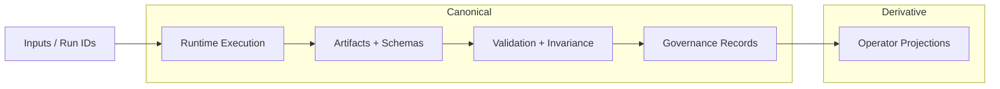

# Abraxas

Deterministic runtime, proof surfaces, and governance tooling for ABX/Abraxas execution closure.

Abraxas combines canonical runtime commands, subsystem governance metadata, validator-facing artifact contracts, and operator scripts in one repository.  
This front door is intentionally truth-scoped: statuses are split into Implemented, Partial, Experimental, and Planned based on repository evidence.




> SVG is a derived artifact. Regenerate from Mermaid source via `scripts/export_architecture_svg.sh`.

---

## Start Here

- [README.md](README.md) — front-door orientation and quickstart.
- [docs/README.md](docs/README.md) — documentation navigation map.
- [docs/architecture/overview.md](docs/architecture/overview.md) — canonical architecture diagram spec and SVG export plan.
- [.abraxas/registries/expected_subsystems.yaml](.abraxas/registries/expected_subsystems.yaml) — expected subsystem registry.
- [.abraxas/subsystems/](.abraxas/subsystems/) — per-subsystem metadata including authorization and lane.
- [scripts/](scripts/) — operational commands and validators.
- [tests/gap_closure/](tests/gap_closure/) — deterministic test lane tied to gap closure.

---

## What Abraxas Is

Abraxas is a multi-surface repository with:

- Canonical runtime and proof paths (`abx/`, `abraxas/`, `.abraxas/`).
- Operator and projection surfaces (`webpanel/`, `server/`, `client/`, `shared/`).
- Deterministic run/validation/report scripts (`scripts/`).
- Contract and artifact surfaces (`schemas/`, `docs/`, `out/`, `artifacts_*`).

The current clearly implemented additive path is `gap_closure_v1`, including runtime artifact emission, validator checks, invariance logging, and stabilization reporting.

---

## Core Principles (Repository-Evidenced)

- Deterministic artifact and hash-based evidence paths.
- Validation-first posture (`PASS` / `FAIL` / `NOT_COMPUTABLE`).
- Explicit governance boundaries via subsystem metadata and registry checks.
- Lane discipline: canonical authority surfaces separated from derivative projections.
- Non-promotive defaults when required evidence is missing.

---

## System Overview

Canonical diagram spec: [docs/architecture/overview.md](docs/architecture/overview.md).

## Architecture

The system architecture is defined as a canonical artifact:

- Source (Mermaid): `docs/assets/architecture/abraxas-architecture-overview.mmd`
- Spec: `docs/architecture/overview.md`

This diagram reflects the current repository topology across execution, validation, governance, and artifact surfaces.
See the spec for explicit truth gaps and confidence labels.

---

### Canonical proof spine

`ingest -> rune invoke -> artifact emit -> ledger linkage -> validator-visible proof -> operator projection -> attestation`

Canonical CLI entrypoints:

```bash
python -m abx.cli proof-run --run-id <RUN_ID>
python -m abx.cli promotion-check --run-id <RUN_ID>
python -m abx.cli promotion-policy --run-id <RUN_ID>
```

### Gap-closure additive lane (documented implemented path)

```bash
python scripts/run_gap_closure_cycle.py --run-id RUN-GAP-FIRST-0001 --mode sandbox --workspace-only
python scripts/validate_gap_closure_artifacts.py --run-id RUN-GAP-FIRST-0001
python scripts/log_gap_closure_invariance.py --run-id RUN-GAP-FIRST-0001 --mode sandbox --workspace-scope workspace_only
python scripts/run_gap_closure_stabilization_report.py --run-id RUN-GAP-FIRST-0001
python scripts/sync_invariance_to_notion.py --run-id RUN-GAP-FIRST-0001 --dry-run
```

---

## Repository Map

| Path | Purpose | Status |
|---|---|---|
| `.abraxas/` | governance policy, registries, subsystem manifests, governance scripts | Implemented |
| `abx/` | canonical CLI/runtime orchestration | Implemented |
| `abraxas/` | domain runtime modules and rune surfaces | Implemented |
| `scripts/` | operational scripts (runtime, validation, reporting, sync) | Implemented / Experimental (mixed) |
| `schemas/` | JSON schemas and contracts | Implemented |
| `tests/` | deterministic and integration test suites | Implemented |
| `docs/` | canon, architecture, workflows, and historical records | Implemented |
| `webpanel/`, `server/`, `client/`, `shared/` | operator and product-facing projection/API/UI surfaces | Partial / Shadow-adjacent (context-dependent) |
| `out/`, `artifacts_seal/`, `artifacts_gate/` | emitted artifacts, reports, validator outputs | Implemented |

---

## Key Workflows

### 1) Validate local deterministic lane

```bash
pytest tests/gap_closure
```

### 2) Run a gap-closure cycle and validate evidence

```bash
python scripts/run_gap_closure_cycle.py --run-id RUN-GAP-FIRST-0001 --mode sandbox --workspace-only
python scripts/validate_gap_closure_artifacts.py --run-id RUN-GAP-FIRST-0001
python scripts/log_gap_closure_invariance.py --run-id RUN-GAP-FIRST-0001 --mode sandbox --workspace-scope workspace_only
```

### 3) Synthesize stabilization and optional Notion dry-run payload

```bash
python scripts/run_gap_closure_stabilization_report.py --run-id RUN-GAP-FIRST-0001
python scripts/sync_invariance_to_notion.py --run-id RUN-GAP-FIRST-0001 --dry-run
```

---

## Validation & Governance

Primary governance and validation surfaces:

- Subsystem registry: `.abraxas/registries/expected_subsystems.yaml`
- Gap subsystem metadata: `.abraxas/subsystems/gap_closure_v1.yaml`
- Governance scripts: `.abraxas/scripts/preflight.py`, `.abraxas/scripts/registry_consistency.py`, `.abraxas/scripts/governance_lint.py`, `.abraxas/scripts/release_readiness.py`
- Canon docs: [docs/CANONICAL_RUNTIME.md](docs/CANONICAL_RUNTIME.md), [docs/VALIDATION_AND_ATTESTATION.md](docs/VALIDATION_AND_ATTESTATION.md)

Governance defaults are fail-closed: missing receipts stay explicit (`partial`, `blocked`, `attestation_pending`, or `NOT_COMPUTABLE`).

### Tier markers (canonical closure ladder)

- **Tier 1**: `python -m abx.cli proof-run --run-id <RUN_ID>`
- **Tier 2**: `python -m abx.cli promotion-check --run-id <RUN_ID>`
- **Tier 2.5**: federated-readiness classification within `promotion-check` artifacts
- **Tier 2.75**: `python -m abx.cli promotion-policy --run-id <RUN_ID>`
- **Tier 3**: `python scripts/run_execution_attestation.py <RUN_ID>` (policy-gated)

Canonical TS sanity marker: `make ts-canonical-check`

---

## Maturity Matrix

| Area | Status | Evidence anchor |
|---|---|---|
| Gap-closure runtime + validator path | Implemented | `scripts/run_gap_closure_cycle.py`, `scripts/validate_gap_closure_artifacts.py`, `tests/gap_closure/` |
| Invariance logging + stabilization report | Implemented | `scripts/log_gap_closure_invariance.py`, `scripts/run_gap_closure_stabilization_report.py` |
| Notion sync integration | Implemented (operator-controlled) | `scripts/sync_invariance_to_notion.py` with dry-run and token gating |
| Promotion decision automation | Partial / gated | recommendation remains explicitly non-promotive when thresholds are unmet |
| Long-tail audit/report script ecosystem | Experimental | heterogeneous script surfaces with mixed canonical relevance |
| Release packaging and broader convergence | Planned / evolving | docs + governance/readiness tooling indicate ongoing convergence |

---

## Installation

### Python

```bash
python -m venv .venv
source .venv/bin/activate
pip install -e .
pip install -e ".[dev]"
```

### JavaScript / TypeScript surfaces (optional)

```bash
npm install
```

---

## Quickstart

1. Run deterministic tests:
   - `pytest tests/gap_closure`
2. Execute a gap-closure run:
   - `python scripts/run_gap_closure_cycle.py --run-id RUN-GAP-FIRST-0001 --mode sandbox --workspace-only`
3. Validate and log invariance:
   - `python scripts/validate_gap_closure_artifacts.py --run-id RUN-GAP-FIRST-0001`
   - `python scripts/log_gap_closure_invariance.py --run-id RUN-GAP-FIRST-0001 --mode sandbox --workspace-scope workspace_only`
4. Generate stabilization summary:
   - `python scripts/run_gap_closure_stabilization_report.py --run-id RUN-GAP-FIRST-0001`

---

## Docs Navigation

Use [docs/README.md](docs/README.md) for documentation routing across canon/governance, architecture, workflows, validation/attestation, subsystems, schemas, and archive materials.

---

## License / Status

A root `LICENSE` file is currently not present in this repository.  
`package.json` declares `MIT` for package scope; verify top-level licensing before redistribution.
