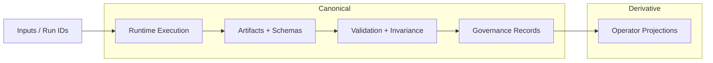

# Abraxas

Deterministic runtime, proof surfaces, and governance tooling for ABX/Abraxas execution closure.

Abraxas combines canonical runtime commands, subsystem governance metadata, validator-facing artifact contracts, and operator scripts in one repository.  
This front door is intentionally truth-scoped: statuses are split into Implemented, Partial, Experimental, and Planned based on repository evidence.



> The README renders the canonical Mermaid source directly. A derived SVG can be regenerated with `scripts/export_architecture_svg.sh` when the local Mermaid/Chrome toolchain is available.

---

## Start Here

- [README.md](README.md) — front-door orientation and quickstart.
- [docs/README.md](docs/README.md) — documentation navigation map.
- [docs/architecture/overview.md](docs/architecture/overview.md) — canonical architecture diagram spec and SVG export plan.
- [.abraxas/registries/expected_subsystems.yaml](.abraxas/registries/expected_subsystems.yaml) — expected subsystem registry.
- [.abraxas/subsystems/](.abraxas/subsystems/) — per-subsystem metadata including authorization and lane.
- [scripts/](scripts/) — operational commands and validators.
- [tests/gap_closure/](tests/gap_closure/) — deterministic test lane tied to gap closure.

---

## What Abraxas Is

Abraxas is a multi-surface repository with:

- Canonical runtime and proof paths (`abx/`, `abraxas/`, `.abraxas/`).
- Operator and projection surfaces (`webpanel/`, `server/`, `client/`, `shared/`).
- Deterministic run/validation/report scripts (`scripts/`).
- Contract and artifact surfaces (`schemas/`, `docs/`, `out/`, `artifacts_*`).

The current clearly implemented additive path is `gap_closure_v1`, including runtime artifact emission, validator checks, invariance logging, and stabilization reporting.

---

## Core Principles (Repository-Evidenced)

- Deterministic artifact and hash-based evidence paths.
- Validation-first posture (`PASS` / `FAIL` / `NOT_COMPUTABLE`).
- Explicit governance boundaries via subsystem metadata and registry checks.
- Lane discipline: canonical authority surfaces separated from derivative projections.
- Non-promotive defaults when required evidence is missing.

---

## System Overview

Canonical diagram spec: [docs/architecture/overview.md](docs/architecture/overview.md).

## Architecture

The system architecture is defined as a canonical artifact:

- Source (Mermaid, canonical): `docs/assets/architecture/abraxas-architecture-overview.mmd`
- Derived SVG (generated): `docs/assets/architecture/abraxas-architecture-overview.svg`
- Spec: `docs/architecture/overview.md`


Regenerate the derived SVG (and optional PNG) from the Mermaid source:

```bash
bash scripts/export_architecture_svg.sh
# optional PNG: EXPORT_PNG=1 bash scripts/export_architecture_svg.sh
```

This diagram reflects the current repository topology across execution, validation, governance, and artifact surfaces.
See the spec for explicit truth gaps and confidence labels.

---

### Canonical proof spine

`ingest -> rune invoke -> artifact emit -> ledger linkage -> validator-visible proof -> operator projection -> attestation`

Canonical CLI entrypoints:

```bash
python -m abx.cli proof-run --run-id <RUN_ID>
python -m abx.cli promotion-check --run-id <RUN_ID>
python -m abx.cli promotion-policy --run-id <RUN_ID>
```

### Gap-closure additive lane (documented implemented path)

```bash
python scripts/run_gap_closure_cycle.py --run-id RUN-GAP-FIRST-0001 --mode sandbox --workspace-only
python scripts/validate_gap_closure_artifacts.py --run-id RUN-GAP-FIRST-0001
python scripts/log_gap_closure_invariance.py --run-id RUN-GAP-FIRST-0001 --mode sandbox --workspace-scope workspace_only
python scripts/run_gap_closure_stabilization_report.py --run-id RUN-GAP-FIRST-0001
python scripts/sync_invariance_to_notion.py --run-id RUN-GAP-FIRST-0001 --dry-run
```

---

## v2.0.1 — Rune Layer

v2.0.1 introduces **typed rune execution, deterministic shadow execution, receipt chaining, replayability, and rollback packets**. Execution remains shadow-only, replayable, receipt-backed, and governance-first.

### Rune Layer Overview

The rune layer provides a structured execution harness for invoking symbolic rune operators in a deterministic, auditable fashion. Every execution step is:

- **Typed**: each rune has a declared input and output schema.
- **Ordered**: steps execute in deterministic ascending order (`deterministic_order`).
- **Receipt-backed**: every step emits a `RuneInvocationReceipt` with SHA-256 hashes for both input and output.
- **Chain-linked**: receipts are canonically chained — changing any one receipt changes the whole `chain_hash`.
- **Replayable**: the same contract + route graph always produces identical receipt chain hashes.
- **Rollback-capable**: a `ExecutionRollbackPacket` records which receipts can be reverted.

### Shadow Execution Model

All execution in v2.0.1 runs in **shadow mode only** (`execution_mode = "shadow_only"`). This means:

- No runtime mutation.
- No Canon mutation.
- No forecast activation.
- No live external calls.

Shadow execution is deterministic stub execution — it produces all governance artifacts (receipts, hashes, replay packets) without side effects.

### Replayability Doctrine

The replay system re-runs the same execution deterministically and compares all receipt chain hashes. A `RuneReplayPacket` is emitted with:

- `deterministic_match = True` when all hashes match.
- `mismatched_receipts` listing any divergent receipts.

Any deviation fails the `replayability_gate` in the doctrine validator.

### Receipt Chaining

`build_receipt_chain(receipts)` produces a canonically ordered, hash-linked chain:

```python
{
  "chain_hash": "<sha256 of canonical chain>",
  "receipt_count": N,
  "receipts": [...]
}
```

Changing any single receipt (input_hash, output_hash, or any field) changes the entire `chain_hash`.

### Rollback Semantics

`ExecutionRollbackPacket` records which execution steps can be reverted:

- `rollback_possible = True` when reverted receipts are present.
- `rollback_possible = False` when no receipts are available (missing evidence → fail-closed).

### Route-Aware Execution

The shadow runner validates:
- Route node is present and non-empty for each step.
- Invalid nodes cause the step to be counted as `failed_steps` and trigger a `not_computable` or `failed` execution status.

### Doctrine Validator Gates (v2.0.1)

Four new gates enforce rune-layer compliance:

| Gate | Description |
|------|-------------|
| `execution_plan_gate` | Invocation plan must exist with unique, ordered steps |
| `execution_receipt_gate` | Receipt chain must have valid 64-char hash and ≥1 receipt |
| `replayability_gate` | Replay packet must confirm `deterministic_match = True` |
| `rollback_gate` | Rollback packet must exist with a valid `rollback_id` |

A pipeline is **not fully compliant** if any gate fails.

### v2.0.1 Commands

```bash
# Registry
python scripts/run_registry.py

# Doctrine validation (all 4 gates)
python scripts/run_doctrine_validator.py

# Shadow execution
python scripts/run_shadow_execution.py

# Replay
python scripts/run_rune_replay.py
```

Generated artifacts:
- `out/execution/latest.json` — shadow run output
- `out/execution/receipts.latest.json` — receipt chain summary
- `out/replay/latest.json` — replay packet
- `out/validators/doctrine_validation.latest.json` — doctrine gate results
- `out/registry/rune_registry.latest.json` — rune catalog index

### v2.0.1 Module Map

| Module | Purpose |
|--------|---------|
| `core/models/governance.py` | `Authority` class with `is_locked()` |
| `core/execution/context.py` | `RuneExecutionContext.v1` |
| `core/execution/shadow_runner.py` | `ShadowExecutionRun.v1` + `run_shadow_execution` |
| `core/execution/replay_runner.py` | `replay_execution` |
| `core/runes/execution.py` | `execute_rune` deterministic harness |
| `core/runes/runtime.py` | `RuneInvocationPlan.v1` + `build_invocation_plan` |
| `core/runes/receipts.py` | `RuneInvocationReceipt.v1` + `build_receipt_chain` |
| `core/runes/replay.py` | `RuneReplayPacket.v1` |
| `core/runes/rollback.py` | `ExecutionRollbackPacket.v1` + `generate_rollback_packet` |
| `core/validators/doctrine.py` | Doctrine validator with 4 rune-layer gates |
| `core/viz/projection.py` | AAL-Viz execution summary projection extension |

---


| Path | Purpose | Status |
|---|---|---|
| `.abraxas/` | governance policy, registries, subsystem manifests, governance scripts | Implemented |
| `abx/` | canonical CLI/runtime orchestration | Implemented |
| `abraxas/` | domain runtime modules and rune surfaces | Implemented |
| `scripts/` | operational scripts (runtime, validation, reporting, sync) | Implemented / Experimental (mixed) |
| `schemas/` | JSON schemas and contracts | Implemented |
| `tests/` | deterministic and integration test suites | Implemented |
| `docs/` | canon, architecture, workflows, and historical records | Implemented |
| `webpanel/`, `server/`, `client/`, `shared/` | operator and product-facing projection/API/UI surfaces | Partial / Shadow-adjacent (context-dependent) |
| `out/`, `artifacts_seal/`, `artifacts_gate/` | emitted artifacts, reports, validator outputs | Implemented |

---

## Key Workflows

### 1) Validate local deterministic lane

```bash
pytest tests/gap_closure
```

### 2) Run a gap-closure cycle and validate evidence

```bash
python scripts/run_gap_closure_cycle.py --run-id RUN-GAP-FIRST-0001 --mode sandbox --workspace-only
python scripts/validate_gap_closure_artifacts.py --run-id RUN-GAP-FIRST-0001
python scripts/log_gap_closure_invariance.py --run-id RUN-GAP-FIRST-0001 --mode sandbox --workspace-scope workspace_only
```

### 3) Synthesize stabilization and optional Notion dry-run payload

```bash
python scripts/run_gap_closure_stabilization_report.py --run-id RUN-GAP-FIRST-0001
python scripts/sync_invariance_to_notion.py --run-id RUN-GAP-FIRST-0001 --dry-run
```

---

## Developer Readiness Loop

Run a deterministic local readiness sweep across dependency governance, rune contracts, focused web/operator tests, and architecture SVG bounds checks:

```bash
make developer-readiness
```

The command writes a structured report to `out/reports/developer_readiness.json` via `scripts/run_developer_readiness.py`. Missing test surfaces remain explicit as `NOT_PRESENT`; no promotion or closure state is inferred from this loop alone.

Read-only comparison snapshots across Developer Readiness and Gap Closure Invariance can be logged with:

```bash
python scripts/log_readiness_comparison.py
```

This writes:
- `out/reports/readiness_comparison.latest.json`
- `out/reports/readiness_comparison_ledger.jsonl`

The comparison ledger is descriptive-only and non-promotive; promotion policy and authority remain governed by existing canonical runtime/policy surfaces.

Read-only promotion preflight advisory can be generated with:

```bash
python scripts/generate_promotion_preflight.py
```

This writes `out/reports/promotion_preflight.latest.json` and is advisory-only (no promotion authority, no threshold or CI gate changes).

## Validation & Governance

Primary governance and validation surfaces:

- Subsystem registry: `.abraxas/registries/expected_subsystems.yaml`
- Gap subsystem metadata: `.abraxas/subsystems/gap_closure_v1.yaml`
- Governance scripts: `.abraxas/scripts/preflight.py`, `.abraxas/scripts/registry_consistency.py`, `.abraxas/scripts/governance_lint.py`, `.abraxas/scripts/release_readiness.py`
- Canon docs: [docs/CANONICAL_RUNTIME.md](docs/CANONICAL_RUNTIME.md), [docs/VALIDATION_AND_ATTESTATION.md](docs/VALIDATION_AND_ATTESTATION.md)

Governance defaults are fail-closed: missing receipts stay explicit (`partial`, `blocked`, `attestation_pending`, or `NOT_COMPUTABLE`).

## Dependency Governance

Abraxas enforces dependency boundaries through:

- `.aal/dependency_manifest.v0.yaml`
- `.aal/dependency_surface_policy.v0.yaml`
- `scripts/check_optional_dependency_boundaries.py`

Key rules:
- CORE_REQUIRED dependencies may affect runtime truth.
- ENTRYPOINT_REQUIRED dependencies may launch surfaces but cannot define truth.
- OPTIONAL_ADAPTER dependencies are limited to rendering/export/bridge roles.
- Unclassified modules fail closed by default.

Run locally:
- `make dependency-check`

### Tier markers (canonical closure ladder)

- **Tier 1**: `python -m abx.cli proof-run --run-id <RUN_ID>`
- **Tier 2**: `python -m abx.cli promotion-check --run-id <RUN_ID>`
- **Tier 2.5**: federated-readiness classification within `promotion-check` artifacts
- **Tier 2.75**: `python -m abx.cli promotion-policy --run-id <RUN_ID>`
- **Tier 3**: `python scripts/run_execution_attestation.py <RUN_ID>` (policy-gated)

Canonical TS sanity marker: `make ts-canonical-check`

---

## Maturity Matrix

| Area | Status | Evidence anchor |
|---|---|---|
| Gap-closure runtime + validator path | Implemented | `scripts/run_gap_closure_cycle.py`, `scripts/validate_gap_closure_artifacts.py`, `tests/gap_closure/` |
| Invariance logging + stabilization report | Implemented | `scripts/log_gap_closure_invariance.py`, `scripts/run_gap_closure_stabilization_report.py` |
| Notion sync integration | Implemented (operator-controlled) | `scripts/sync_invariance_to_notion.py` with dry-run and token gating |
| Promotion decision automation | Partial / gated | recommendation remains explicitly non-promotive when thresholds are unmet |
| Long-tail audit/report script ecosystem | Experimental | heterogeneous script surfaces with mixed canonical relevance |
| Release packaging and broader convergence | Planned / evolving | docs + governance/readiness tooling indicate ongoing convergence |

---

## Installation

### Python

```bash
python -m venv .venv
source .venv/bin/activate
pip install -e .
pip install -e ".[dev]"
```

### JavaScript / TypeScript surfaces (optional)

```bash
npm install
```

---

## Quickstart

1. Run deterministic tests:
   - `pytest tests/gap_closure`
2. Execute a gap-closure run:
   - `python scripts/run_gap_closure_cycle.py --run-id RUN-GAP-FIRST-0001 --mode sandbox --workspace-only`
3. Validate and log invariance:
   - `python scripts/validate_gap_closure_artifacts.py --run-id RUN-GAP-FIRST-0001`
   - `python scripts/log_gap_closure_invariance.py --run-id RUN-GAP-FIRST-0001 --mode sandbox --workspace-scope workspace_only`
4. Generate stabilization summary:
   - `python scripts/run_gap_closure_stabilization_report.py --run-id RUN-GAP-FIRST-0001`

---

## Docs Navigation

Use [docs/README.md](docs/README.md) for documentation routing across canon/governance, architecture, workflows, validation/attestation, subsystems, schemas, and archive materials.

---

## License / Status

A root `LICENSE` file is currently not present in this repository.  
`package.json` declares `MIT` for package scope; verify top-level licensing before redistribution.
