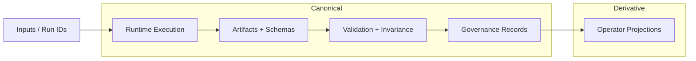

# Abraxas

Deterministic runtime, proof surfaces, and governance tooling for ABX/Abraxas execution closure.

Abraxas combines canonical runtime commands, subsystem governance metadata, validator-facing artifact contracts, and operator scripts in one repository.  
This front door is intentionally truth-scoped: statuses are split into Implemented, Partial, Experimental, and Planned based on repository evidence.


```mermaid
flowchart LR
  A[Inputs / Run IDs] --> B[Runtime Execution]
  B --> C[Artifacts + Schemas]
  C --> D[Validation + Invariance]
  D --> E[Governance Records]
  E --> F[Operator Projections]

  subgraph Canonical
    B
    C
    D
    E
  end

  subgraph Derivative
    F
  end
```

> The README renders the canonical Mermaid source directly. A derived SVG can be regenerated with `scripts/export_architecture_svg.sh` when the local Mermaid/Chrome toolchain is available.

---

## Start Here

- [docs/SIBLING_REPOS.md](docs/SIBLING_REPOS.md) — doctrine sibling (`Abraxas-v2.0`) vs this runtime/proof repo.
- [docs/README_HEADING_MAP.md](docs/README_HEADING_MAP.md) — `v2.0.1` / `v2.0.5` heading strings are local modules.
- [README.md](README.md) — front-door orientation and quickstart.
- [docs/README.md](docs/README.md) — documentation navigation map.
- [docs/architecture/overview.md](docs/architecture/overview.md) — canonical architecture diagram spec and SVG export plan.
- [.abraxas/registries/expected_subsystems.yaml](.abraxas/registries/expected_subsystems.yaml) — expected subsystem registry.
- [.abraxas/subsystems/](.abraxas/subsystems/) — per-subsystem metadata including authorization and lane.
- [scripts/](scripts/) — operational commands and validators.
- [tests/gap_closure/](tests/gap_closure/) — deterministic test lane tied to gap closure.

---

## What Abraxas Is

Abraxas is a multi-surface repository with:

- Canonical runtime and proof paths (`abx/`, `abraxas/`, `.abraxas/`).
- Operator and projection surfaces (`webpanel/`, `server/`, `client/`, `shared/`).
- Deterministic run/validation/report scripts (`scripts/`).
- Contract and artifact surfaces (`schemas/`, `docs/`, `out/`, `artifacts_*`).

The current clearly implemented additive path is `gap_closure_v1`, including runtime artifact emission, validator checks, invariance logging, and stabilization reporting.

---

## Core Principles (Repository-Evidenced)

- Deterministic artifact and hash-based evidence paths.
- Validation-first posture (`PASS` / `FAIL` / `NOT_COMPUTABLE`).
- Explicit governance boundaries via subsystem metadata and registry checks.
- Lane discipline: canonical authority surfaces separated from derivative projections.
- Non-promotive defaults when required evidence is missing.

---

## System Overview

Canonical diagram spec: [docs/architecture/overview.md](docs/architecture/overview.md).

## Architecture

The system architecture is defined as a canonical artifact:

- Source (Mermaid, canonical): `docs/assets/architecture/abraxas-architecture-overview.mmd`
- Derived SVG (generated): `docs/assets/architecture/abraxas-architecture-overview.svg`
- Spec: `docs/architecture/overview.md`


Regenerate the derived SVG (and optional PNG) from the Mermaid source:

```bash
bash scripts/export_architecture_svg.sh
# optional PNG: EXPORT_PNG=1 bash scripts/export_architecture_svg.sh
```

This diagram reflects the current repository topology across execution, validation, governance, and artifact surfaces.
See the spec for explicit truth gaps and confidence labels.

---

### Canonical proof spine

`ingest -> rune invoke -> artifact emit -> ledger linkage -> validator-visible proof -> operator projection -> attestation`

Canonical CLI entrypoints:

```bash
python -m abx.cli proof-run --run-id <RUN_ID>
python -m abx.cli promotion-check --run-id <RUN_ID>
python -m abx.cli promotion-policy --run-id <RUN_ID>
```

### Gap-closure additive lane (documented implemented path)

```bash
python scripts/run_gap_closure_cycle.py --run-id RUN-GAP-FIRST-0001 --mode sandbox --workspace-only
python scripts/validate_gap_closure_artifacts.py --run-id RUN-GAP-FIRST-0001
python scripts/log_gap_closure_invariance.py --run-id RUN-GAP-FIRST-0001 --mode sandbox --workspace-scope workspace_only
python scripts/run_gap_closure_stabilization_report.py --run-id RUN-GAP-FIRST-0001
python scripts/sync_invariance_to_notion.py --run-id RUN-GAP-FIRST-0001 --dry-run
```

---

## Rune layer (local module)

Local proof-module label. Not a promotion of `Abraxas-v2.0` candidate posture. Version tokens below (`v2.0.1`) are this repo's module tags.

v2.0.1 introduces **typed rune execution, deterministic shadow execution, receipt chaining, replayability, and rollback packets**. Execution remains shadow-only, replayable, receipt-backed, and governance-first.
