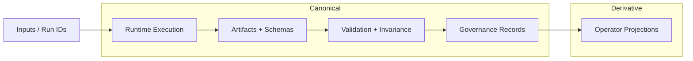

# Abraxas

Deterministic runtime, proof surfaces, and governance tooling for ABX/Abraxas execution closure.

Abraxas combines canonical runtime commands, subsystem governance metadata, validator-facing artifact contracts, and operator scripts in one repository.  
This front door is intentionally truth-scoped: statuses are split into Implemented, Partial, Experimental, and Planned based on repository evidence.


```mermaid
flowchart LR
  A[Inputs / Run IDs] --> B[Runtime Execution]
  B --> C[Artifacts + Schemas]
  C --> D[Validation + Invariance]
  D --> E[Governance Records]
  E --> F[Operator Projections]

  subgraph Canonical
    B
    C
    D
    E
  end

  subgraph Derivative
    F
  end
```

> The README renders the canonical Mermaid source directly. A derived SVG can be regenerated with `scripts/export_architecture_svg.sh` when the local Mermaid/Chrome toolchain is available.

---

## Start Here

- [docs/SIBLING_REPOS.md](docs/SIBLING_REPOS.md) — doctrine sibling (`Abraxas-v2.0`) vs this runtime/proof repo.
- [docs/README_HEADING_MAP.md](docs/README_HEADING_MAP.md) — `v2.0.1` / `v2.0.5` heading strings are local modules.
- [README.md](README.md) — front-door orientation and quickstart.
- [docs/README.md](docs/README.md) — documentation navigation map.
- [docs/architecture/overview.md](docs/architecture/overview.md) — canonical architecture diagram spec and SVG export plan.
- [.abraxas/registries/expected_subsystems.yaml](.abraxas/registries/expected_subsystems.yaml) — expected subsystem registry.
- [.abraxas/subsystems/](.abraxas/subsystems/) — per-subsystem metadata including authorization and lane.
- [scripts/](scripts/) — operational commands and validators.
- [tests/gap_closure/](tests/gap_closure/) — deterministic test lane tied to gap closure.

---

## What Abraxas Is

Abraxas is a multi-surface repository with:

- Canonical runtime and proof paths (`abx/`, `abraxas/`, `.abraxas/`).
- Operator and projection surfaces (`webpanel/`, `server/`, `client/`, `shared/`).
- Deterministic run/validation/report scripts (`scripts/`).
- Contract and artifact surfaces (`schemas/`, `docs/`, `out/`, `artifacts_*`).

The current clearly implemented additive path is `gap_closure_v1`, including runtime artifact emission, validator checks, invariance logging, and stabilization reporting.

---

## Core Principles (Repository-Evidenced)

- Deterministic artifact and hash-based evidence paths.
- Validation-first posture (`PASS` / `FAIL` / `NOT_COMPUTABLE`).
- Explicit governance boundaries via subsystem metadata and registry checks.
- Lane discipline: canonical authority surfaces separated from derivative projections.
- Non-promotive defaults when required evidence is missing.

---

## System Overview

Canonical diagram spec: [docs/architecture/overview.md](docs/architecture/overview.md).

## Architecture

The system architecture is defined as a canonical artifact:

- Source (Mermaid, canonical): `docs/assets/architecture/abraxas-architecture-overview.mmd`
- Derived SVG (generated): `docs/assets/architecture/abraxas-architecture-overview.svg`
- Spec: `docs/architecture/overview.md`


Regenerate the derived SVG (and optional PNG) from the Mermaid source:

```bash
bash scripts/export_architecture_svg.sh
# optional PNG: EXPORT_PNG=1 bash scripts/export_architecture_svg.sh
```

This diagram reflects the current repository topology across execution, validation, governance, and artifact surfaces.
See the spec for explicit truth gaps and confidence labels.

---

### Canonical proof spine

`ingest -> rune invoke -> artifact emit -> ledger linkage -> validator-visible proof -> operator projection -> attestation`

Canonical CLI entrypoints:

```bash
python -m abx.cli proof-run --run-id <RUN_ID>
python -m abx.cli promotion-check --run-id <RUN_ID>
python -m abx.cli promotion-policy --run-id <RUN_ID>
```

### Gap-closure additive lane (documented implemented path)

```bash
python scripts/run_gap_closure_cycle.py --run-id RUN-GAP-FIRST-0001 --mode sandbox --workspace-only
python scripts/validate_gap_closure_artifacts.py --run-id RUN-GAP-FIRST-0001
python scripts/log_gap_closure_invariance.py --run-id RUN-GAP-FIRST-0001 --mode sandbox --workspace-scope workspace_only
python scripts/run_gap_closure_stabilization_report.py --run-id RUN-GAP-FIRST-0001
python scripts/sync_invariance_to_notion.py --run-id RUN-GAP-FIRST-0001 --dry-run
```

---

## Rune layer (local module)

Local proof-module label. Not a promotion of `Abraxas-v2.0` candidate posture. Version tokens below (`v2.0.1`) are this repo's module tags.

v2.0.1 introduces **typed rune execution, deterministic shadow execution, receipt chaining, replayability, and rollback packets**. Execution remains shadow-only, replayable, receipt-backed, and governance-first.

### Rune Layer Overview

The rune layer provides a structured execution harness for invoking symbolic rune operators in a deterministic, auditable fashion. Every execution step is:

- **Typed**: each rune has a declared input and output schema.
- **Ordered**: steps execute in deterministic ascending order (`deterministic_order`).
- **Receipt-backed**: every step emits a `RuneInvocationReceipt` with SHA-256 hashes for both input and output.
- **Chain-linked**: receipts are canonically chained — changing any one receipt changes the whole `chain_hash`.
- **Replayable**: the same contract + route graph always produces identical receipt chain hashes.
- **Rollback-capable**: a `ExecutionRollbackPacket` records which receipts can be reverted.

### Shadow Execution Model

All execution in v2.0.1 runs in **shadow mode only** (`execution_mode = "shadow_only"`). This means:

- No runtime mutation.
- No Canon mutation.
- No forecast activation.
- No live external calls.

Shadow execution is deterministic stub execution — it produces all governance artifacts (receipts, hashes, replay packets) without side effects.

### Replayability Doctrine

The replay system re-runs the same execution deterministically and compares all receipt chain hashes. A `RuneReplayPacket` is emitted with:

- `deterministic_match = True` when all hashes match.
- `mismatched_receipts` listing any divergent receipts.

Any deviation fails the `replayability_gate` in the doctrine validator.

### Receipt Chaining

`build_receipt_chain(receipts)` produces a canonically ordered, hash-linked chain.

Changing any single receipt (input_hash, output_hash, or any field) changes the entire `chain_hash`.

### Rollback Semantics

`ExecutionRollbackPacket` records which execution steps can be reverted:

- `rollback_possible = True` when reverted receipts are present.
- `rollback_possible = False` when no receipts are available (missing evidence → fail-closed).

### Route-Aware Execution

The shadow runner validates:
- Route node is present and non-empty for each step.
- Invalid nodes cause the step to be counted as `failed_steps` and trigger a `not_computable` or `failed` execution status.

### Doctrine Validator Gates (v2.0.1)

Four new gates enforce rune-layer compliance: `execution_plan_gate`, `execution_receipt_gate`, `replayability_gate`, `rollback_gate`.

A pipeline is **not fully compliant** if any gate fails.

### Rune layer commands

```bash
python scripts/run_registry.py
python scripts/run_doctrine_validator.py
python scripts/run_shadow_execution.py
python scripts/run_rune_replay.py
```

Generated artifacts live under `out/execution/`, `out/replay/`, `out/validators/`, and `out/registry/`.

---

## Key Workflows

### 1) Validate local deterministic lane

```bash
pytest tests/gap_closure
```

### 2) Run a gap-closure cycle and validate evidence

```bash
python scripts/run_gap_closure_cycle.py --run-id RUN-GAP-FIRST-0001 --mode sandbox --workspace-only
python scripts/validate_gap_closure_artifacts.py --run-id RUN-GAP-FIRST-0001
python scripts/log_gap_closure_invariance.py --run-id RUN-GAP-FIRST-0001 --mode sandbox --workspace-scope workspace_only
```

### 3) Synthesize stabilization and optional Notion dry-run payload

```bash
python scripts/run_gap_closure_stabilization_report.py --run-id RUN-GAP-FIRST-0001
python scripts/sync_invariance_to_notion.py --run-id RUN-GAP-FIRST-0001 --dry-run
```

---

## Developer Readiness Loop

```bash
make developer-readiness
```

Writes `out/reports/developer_readiness.json`. Missing test surfaces stay `NOT_PRESENT`. No promotion is inferred from this loop.

## Validation & Governance

- Subsystem registry: `.abraxas/registries/expected_subsystems.yaml`
- Gap subsystem metadata: `.abraxas/subsystems/gap_closure_v1.yaml`
- Governance scripts under `.abraxas/scripts/`
- Canon docs: [docs/CANONICAL_RUNTIME.md](docs/CANONICAL_RUNTIME.md), [docs/VALIDATION_AND_ATTESTATION.md](docs/VALIDATION_AND_ATTESTATION.md)

Missing receipts stay explicit (`partial`, `blocked`, `attestation_pending`, or `NOT_COMPUTABLE`).

## Dependency Governance

- `.aal/dependency_manifest.v0.yaml`
- `.aal/dependency_surface_policy.v0.yaml`
- `make dependency-check`

CORE_REQUIRED may affect runtime truth. ENTRYPOINT_REQUIRED may launch surfaces but cannot define truth. OPTIONAL_ADAPTER is render/export/bridge only.

### Tier markers

- Tier 1: `python -m abx.cli proof-run --run-id <RUN_ID>`
- Tier 2: `python -m abx.cli promotion-check --run-id <RUN_ID>`
- Tier 2.75: `python -m abx.cli promotion-policy --run-id <RUN_ID>`
- Tier 3: `python scripts/run_execution_attestation.py <RUN_ID>` (policy-gated)

---

## Maturity Matrix

| Area | Status |
|---|---|
| Gap-closure runtime + validator path | Implemented |
| Invariance logging + stabilization report | Implemented |
| Notion sync integration | Implemented (operator-controlled) |
| Promotion decision automation | Partial / gated |
| Long-tail audit/report script ecosystem | Experimental |
| Release packaging and broader convergence | Planned / evolving |

---

## Installation

```bash
python -m venv .venv
source .venv/bin/activate
pip install -e .
pip install -e ".[dev]"
```

---

## Quickstart

1. `pytest tests/gap_closure`
2. `python scripts/run_gap_closure_cycle.py --run-id RUN-GAP-FIRST-0001 --mode sandbox --workspace-only`
3. `python scripts/validate_gap_closure_artifacts.py --run-id RUN-GAP-FIRST-0001`
4. `python scripts/run_gap_closure_stabilization_report.py --run-id RUN-GAP-FIRST-0001`

---

## Docs Navigation

Use [docs/README.md](docs/README.md) for routing. Sibling and heading map: [docs/SIBLING_REPOS.md](docs/SIBLING_REPOS.md), [docs/README_HEADING_MAP.md](docs/README_HEADING_MAP.md).

---

## License / Status

A root `LICENSE` file is currently not present. `package.json` declares `MIT` for package scope; verify top-level licensing before redistribution.

---

## Adaptive sandbox (local module)

Local proof-module label. Version tokens below (`v2.0.5`) are this repo's module tags.

v2.0.5 introduces sandboxed adaptive experimentation and operator-reviewed promotion candidates. This is **STILL NOT live autonomy**. All execution remains shadow-only, deterministic, replayable, and sandbox-isolated.

Doctrine: Sandbox → Mutations → Replay → Stabilization → Promotion Candidate → Operator Review.

`SandboxPromotionCandidate.v1` is always created with `promotion_allowed=False` and `operator_review_required=True`.

Hard boundaries: no live autonomy, no Canon mutation, no runtime mutation outside sandbox, no external APIs in this module.
