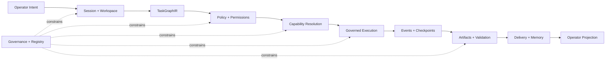

# Abraxas

**Governed AI Operating System**  
*Deterministic • Observable • Recursive • Provenance-Backed*

> Structure before narrative. Evidence before authority. Governance before autonomy.

Abraxas is evolving from a governed deterministic execution framework into a unified AI operating system built from its existing runtime, ABX-Runes, artifact, ledger, validation, governance, continuity, and operator infrastructure.

The repository already contains a strong execution and assurance kernel. The current program is to compress those existing components behind one canonical session, workspace, process, capability, event, artifact, memory, and delivery lifecycle rather than adding disconnected subsystems.

## Canonical Direction


```mermaid
flowchart LR
  A[Operator Intent] --> B[Session + Workspace]
  B --> C[TaskGraphIR]
  C --> D[Policy + Permissions]
  D --> E[Capability Resolution]
  E --> F[Governed Execution]
  F --> G[Events + Checkpoints]
  G --> H[Artifacts + Validation]
  H --> I[Delivery + Memory]
  I --> J[Operator Projection]

  K[Governance + Registry] -. constrains .-> B
  K -. constrains .-> D
  K -. constrains .-> E
  K -. constrains .-> F
  K -. constrains .-> H
```

Canonical lifecycle:

```text
operator intent
→ session and workspace context
→ deterministic task graph
→ policy and permission evaluation
→ capability resolution
→ governed execution
→ checkpoints and artifacts
→ validation and provenance
→ delivery
→ memory and continuity commit
```

## Start Here

- [AI OS Contract](docs/ai-os/AI_OS_CONTRACT.md) — canonical target architecture and invariants.
- [AI OS Roadmap](docs/ai-os/ROADMAP.md) — phased implementation sequence and exit criteria.
- [JCode Execution Plan](docs/ai-os/JCODE_EXECUTION_PLAN.md) — bounded agent plan for the first AI OS foundation campaign.
- [Documentation Index](docs/README.md) — repository documentation map.
- [Canonical Runtime](docs/CANONICAL_RUNTIME.md) — current proof and execution spine.
- [Validation and Attestation](docs/VALIDATION_AND_ATTESTATION.md) — assurance boundaries.
- [Subsystem Inventory](docs/SUBSYSTEM_INVENTORY.md) — current subsystem roles and maturity.
- [Active Plan](PLANS.md) — current execution queue.

## Current Architecture

### Strong foundation

- deterministic runtime and hash-based artifacts;
- ABX-Runes typed execution, receipts, replay, and rollback;
- governance registries and subsystem metadata;
- validation, invariance, readiness, and promotion-policy surfaces;
- continuity-ledger and task-graph prototypes;
- operator projection and web surfaces;
- sandboxed adaptive experimentation.

### Partial

- task and process intermediate representation;
- continuity and stabilization runtime;
- capability abstraction;
- policy-to-projection wiring;
- operator-console consistency;
- artifact addressing and linkage.

### Remaining AI OS services

- canonical session and persistent workspace models;
- unified process orchestrator;
- event bus and reconstructable state machine;
- dependency-aware scheduler;
- model-provider routing;
- principal-level permissions and secret brokerage;
- governed agent lifecycle;
- scoped persistent memory;
- canonical artifact filesystem;
- plugin installation and versioning.

## Existing Canonical Proof Spine

The current repository-evidenced proof path remains authoritative during migration:

```text
ingest
→ rune invoke
→ artifact emit
→ ledger linkage
→ validator-visible proof
→ operator projection
→ attestation
```

Canonical commands include:

```bash
python -m abx.cli proof-run --run-id <RUN_ID>
python -m abx.cli promotion-check --run-id <RUN_ID>
python -m abx.cli promotion-policy --run-id <RUN_ID>
```

The AI OS kernel must reuse and route through this infrastructure. It must not silently fork proof, policy, validation, or authority semantics.

## Package Roles

| Path | Role | Status |
|---|---|---|
| `.abraxas/` | governance, policy, subsystem manifests, registries | Implemented |
| `abx/` | canonical CLI and proof orchestration | Implemented |
| `abraxas/` | domain runtime, rune, oracle, detector, and execution modules | Implemented / mixed |
| `abx_familiar/` | task graph, continuity, and delegated-runtime prototypes | Partial |
| `schemas/` | artifact and execution contracts | Implemented |
| `scripts/` | operational, validation, reporting, and compatibility entrypoints | Mixed |
| `webpanel/`, `server/`, `client/`, `shared/` | operator projections and product surfaces | Partial / mixed |
| `abx_os/` | canonical AI OS kernel and service boundary | Planned |

## AI OS Invariants

1. Canonical transforms, ordering, identifiers, and hashes are deterministic where computable.
2. Missing evidence resolves to `NOT_COMPUTABLE`, never fabricated completion.
3. Every process, capability call, artifact, memory write, and delivery carries provenance.
4. External calls and mutations require explicit grants and policy evaluation.
5. Projection surfaces may display canonical state but may not redefine it.
6. Long-running work supports checkpoints, replay, cancellation, and bounded recovery.
7. Every executable surface is registered as a capability or classified as private implementation.
8. Agents cannot expand their own authority.

## First Implementation Milestone

The first milestone is one end-to-end vertical slice:

```text
operator request
→ SessionEnvelope.v1
→ OperatorIntent.v1
→ TaskGraphIR.v1
→ capability resolution
→ one model inference
→ one repository read
→ checkpoint
→ artifact registration
→ validation
→ DeliveryPack.v1
→ continuity and memory commit
→ operator projection
```

Broad migrations and UI expansion should not begin until this path is deterministic, replayable, tested, and documented.

## Development Readiness

Use repository-native validation surfaces before claiming closure:

```bash
pytest -q
make dependency-check
make developer-readiness
make governance-lint
make ts-canonical-check
```

Known and pre-existing failures must be separated from new regressions. Missing toolchain or evidence must remain explicit.

## Status

Abraxas is not yet a complete AI OS. It is a mature governed execution and assurance foundation with an active unification roadmap.

Current full-system AI OS readiness is best treated as **partial** until the canonical workspace, process, capability, event, memory, permission, scheduler, and agent-runtime layers are implemented and verified.
