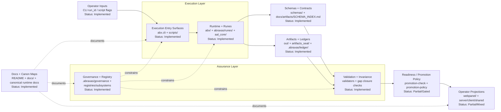

# Abraxas Canonical Architecture Diagram Spec

## 1) Brief audit summary

This canonical view is derived from repository-grounded surfaces:

- Execution entrypoints: `abx.cli` commands and deterministic scripts under `scripts/`.
- Runtime layer: `abx/`, `abraxas/runes/`, and `aal_core/`.
- Contract layer: `schemas/` and schema index under `docs/artifacts/SCHEMA_INDEX.md`.
- Assurance layer: validator and invariance flows (`scripts/validate_gap_closure_artifacts.py`, `scripts/log_gap_closure_invariance.py`) and governance constraints under `.abraxas/`.
- Artifact layer: `out/`, `artifacts_seal/`, and `.abraxas/ledger/`.
- Documentation/canon layer: root README, docs index, canonical runtime and validation docs.

No binary diagram assets were found as canonical sources; Mermaid is used as source-of-truth.

---

## 2) Canonical architecture diagram recommendation

**Canonical View Title:** `Abraxas Repo Architecture at a Glance`

Use a single left-to-right graph with 10 major nodes. Keep it stable and readable for both root README and docs pages.

---

## 3) Mermaid diagram



Mermaid source file: `docs/assets/architecture/abraxas-architecture-overview.mmd`.

---

## 4) Diagram spec

### 4.1 Diagram title

**Abraxas Repo Architecture at a Glance**

### 4.2 Purpose

Provide one trustworthy, high-level map showing where execution occurs, where contracts live, where governance/validation constrain behavior, and where artifacts/projections land.

### 4.3 Node definitions

| Node | Repo path(s) | Purpose | Status |
|---|---|---|---|
| Operator Inputs | command layer across README/docs workflows | run IDs and flags initiating execution | Implemented |
| Execution Entry Surfaces | `abx/cli.py`, `scripts/` | orchestrate canonical and additive runs | Implemented |
| Runtime + Runes | `abx/`, `abraxas/runes/`, `aal_core/` | deterministic runtime and rune execution | Implemented |
| Schemas + Contracts | `schemas/`, `docs/artifacts/SCHEMA_INDEX.md` | define artifact and bridge contracts | Implemented |
| Artifacts + Ledgers | `out/`, `artifacts_seal/`, `.abraxas/ledger/` | persist run outputs, reports, and ledger records | Implemented |
| Validation + Invariance | validator and invariance scripts in `scripts/` | re-check artifacts and evaluate invariance | Implemented |
| Governance + Registry | `.abraxas/governance/`, `.abraxas/registries/`, `.abraxas/subsystems/` | constrain admissible behavior and subsystem policy | Implemented |
| Readiness / Promotion Policy | `abx.cli promotion-check`, `abx.cli promotion-policy` | classify and gate promotion posture | Partial / Gated |
| Operator Projections | `webpanel/`, `server/`, `client/`, `shared/` | present derivative operator-facing summaries and APIs | Partial / Mixed |
| Docs + Canon Maps | `README.md`, `docs/`, canonical runtime docs | document and orient architecture/governance usage | Implemented |

### 4.4 Edge definitions

| Source | Destination | Relationship | Confidence |
|---|---|---|---|
| Operator Inputs | Execution Entry Surfaces | initiates run commands | explicit |
| Execution Entry Surfaces | Runtime + Runes | invokes execution logic | explicit |
| Runtime + Runes | Schemas + Contracts | uses contracts for artifact shape/validation compatibility | explicit |
| Runtime + Runes | Artifacts + Ledgers | emits runtime artifacts and ledger-linked outputs | explicit |
| Schemas + Contracts | Validation + Invariance | provides contract references for checks | explicit |
| Artifacts + Ledgers | Validation + Invariance | provides evidence inputs for validators/invariance checks | explicit |
| Governance + Registry | Execution Entry Surfaces | constrains allowed behavior and policy posture | explicit |
| Governance + Registry | Runtime + Runes | constrains subsystem authorization/lane/policy | explicit |
| Governance + Registry | Validation + Invariance | defines closure/readiness requirements | explicit |
| Validation + Invariance | Readiness / Promotion Policy | readiness/policy commands consume validator evidence | explicit |
| Readiness / Promotion Policy | Operator Projections | projection surfaces render policy/readiness states | documented but not fully wired |
| Docs + Canon Maps | Execution/Governance/Operator nodes | documents usage and boundaries | inferred from structure |

### 4.5 Omitted detail

Intentionally omitted for readability:

- Hundreds of long-tail audit scripts in `scripts/`.
- Per-subsystem internal fields and all registry/schema keys.
- TS service internals and UI component-level topology.
- Historical and archival docs outside canonical navigation.

### 4.6 Truth gaps

- Projection surface consistency (`webpanel` vs `server/client/shared`) is documented but mixed in maturity.
- Some script surfaces are shadow/diagnostic and not canonical execution paths.
- SVG export requires external Mermaid CLI availability; in restricted environments this may remain pending until package access is available.

---

## 5) SVG export plan

### Asset location

`docs/assets/architecture/`

### Suggested filenames

- `abraxas-architecture-overview.mmd` (canonical source)
- `abraxas-architecture-overview.svg` (derived static asset)
- `abraxas-architecture-overview.png` (optional derived raster)
- `mermaid-export-config.json` (derived export settings, not architecture authority)

### Export workflow

1. Keep Mermaid source in `docs/assets/architecture/abraxas-architecture-overview.mmd`.
2. Use the repo wrapper so export config and SVG normalization stay consistent:
   ```bash
   scripts/export_architecture_svg.sh
   ```
3. The wrapper uses Mermaid CLI with `docs/assets/architecture/mermaid-export-config.json`, disables `useMaxWidth`, and normalizes the final SVG width/height against its `viewBox` so GitHub renders it at readable scale.
4. Optional PNG export:
   ```bash
   EXPORT_PNG=1 scripts/export_architecture_svg.sh
   ```
5. Keep README/docs Mermaid blocks as the canonical GitHub-facing render path. Treat SVG/PNG as optional derived artifacts.

6. Validate derived SVG safety constraints before merge:
   ```bash
   scripts/validate_architecture_svg.sh
   ```

### Style guidance

- Neutral palette with high contrast text.
- Rectangular nodes, minimal decorative styling.
- Keep edge labels sparse and short.
- Validate readability at default GitHub content width.
- Avoid responsive SVG sizing (`useMaxWidth`) for derived static assets intended for GitHub markdown rendering.

### Source-of-truth rule

- **Canonical:** Mermaid source (`.mmd` + embedded Mermaid blocks in docs).
- **Derived:** SVG/PNG exports.

---

## 6) README/docs integration recommendation

- Root README: render the canonical Mermaid block directly and link to this architecture spec page.
- Docs index: link this file under Architecture section as the primary architecture reference.
- Do not embed a derived SVG in README unless it has been regenerated and visually verified.
- Do not create additional architecture pages until a second stable view is required.

---

## 7) Optional secondary diagram recommendations

1. **Gap Closure Deterministic Flow**
   - Purpose: show `run_gap_closure_cycle -> validate -> invariance -> stabilization` chain.
   - Timing: **now** (high operator value, low complexity).

2. **Promotion Gate Ladder (Tier 1 -> Tier 2 -> Tier 2.75 -> Tier 3)**
   - Purpose: separate readiness classification from permission/policy execution.
   - Timing: **later**, after governance lint baseline is stabilized.

3. **Governance Registry Topology**
   - Purpose: map `.abraxas/registries`, subsystem manifests, and ledger records.
   - Timing: **later**, if onboarding confusion persists.

---

## 8) Truth gaps / uncertainty notes

- The canonical path is clear in docs, but wide script surface area introduces discoverability ambiguity.
- Some TypeScript and projection surfaces are secondary and should not be interpreted as authoritative proof sources.
- No claim in this diagram spec implies promotion, closure, or attestation beyond runtime/validator receipts.
